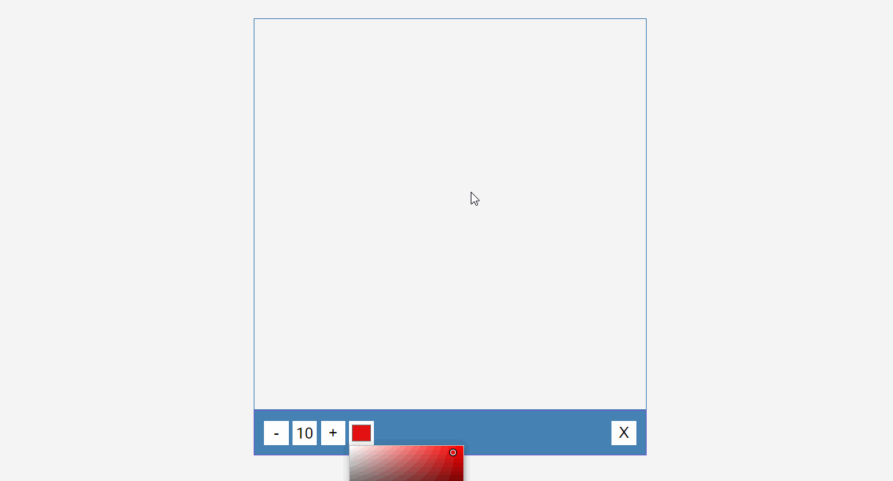

# Drawing App



## 🦉 Main information

Drawing App where you will teach how to use Html canvas elements and JavaScript API for drawing different shapes and images.

The project goal:
- use Html canvas elements;
- use JavaScript API to draw the shapes, circles, rectangles, images, whatever lines etc.;
- implement JavaScript events to click and draw;
- add control buttons for changing color and width of the lines.

## 🦊 Useful links 

### 

```

```

### 

```

```

### 

```

```

### 

```

```

### 

```
```

### 

```

```

### 

```

```

## ⚡ Built With
[HTML5](https://www.w3schools.com/html/) / [CSS3](https://www.w3schools.com/css/) / [JavaScript](https://www.w3schools.com/js/)
